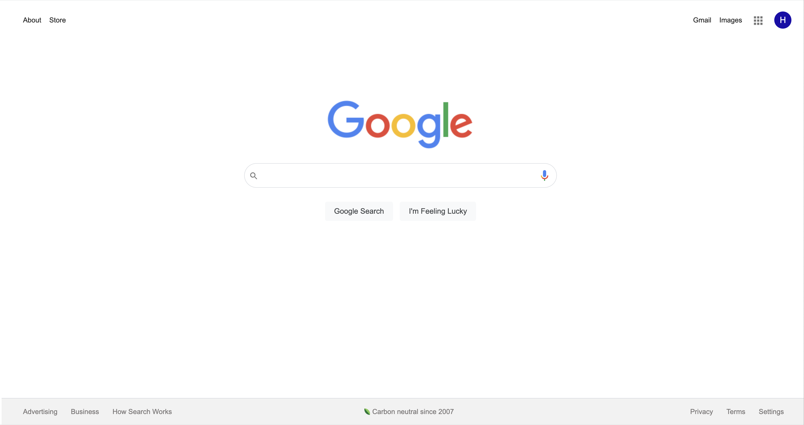

# Google Homepage 

Built with HTML and CSS to mirror Google's standard homepage. 

The goal of this projects was to practice building a responsive website and  using Chrome DevTools to find the correct colors, fonts, spacing, etc. To ensure that the page is responsive, I used media queries and flexbox displays. 

## Screenshot

